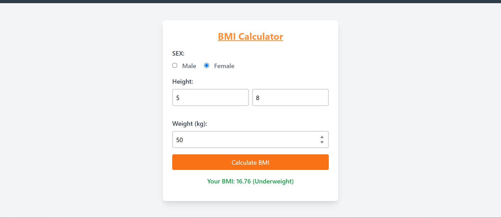
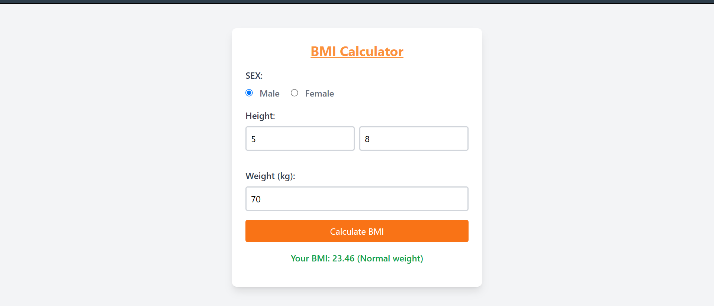
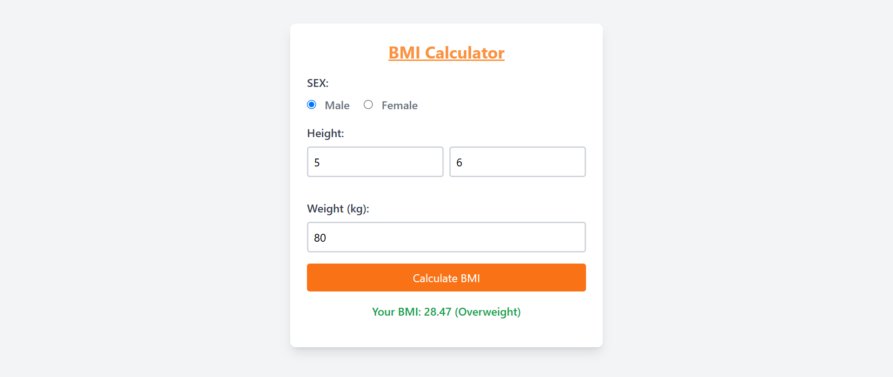
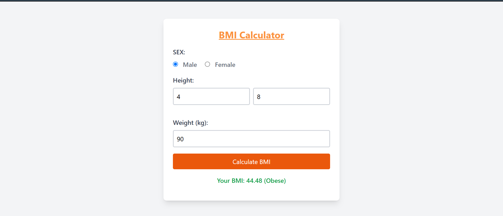

# BMI Calculator 🧮

A simple and responsive Body Mass Index (BMI) Calculator built using **HTML**, **Tailwind CSS**, and **JavaScript**. This calculator allows users to enter their height in feet and inches, weight in kilograms, and determines their BMI category (Underweight, Normal, Overweight, or Obese).

## 🖥️ Live Demo

<!-- Optionally add a GitHub Pages or Netlify link here -->
[Live Demo](#)

---

## 🚀 Features

- User-friendly interface with responsive design using **Tailwind CSS**
- Input for **sex**, **height (feet + inches)**, and **weight (kg)**
- Validates input before calculating BMI
- Displays BMI value and corresponding category:
  - Underweight: BMI < 18.5
  - Normal weight: BMI 18.5 - 24.9
  - Overweight: BMI 25 - 29.9
  - Obese: BMI 30+

---

## 📸  BMI Calculator Screenshots

---

## 🛠️ Technologies Used

- **HTML5** – Structure of the page
- **Tailwind CSS** – Styling and layout
- **JavaScript** – Logic for BMI calculation and DOM manipulation

---

## 📂 File Structure

bmi-calculator/ 
|
├── index.html # Main HTML file 
├── README.md # Project documentation 
└── screenshot.png # Screenshot image 

---

## ⚙️ How to Use

1. Clone or download this repository.
2. Open `index.html` in your browser.
3. Enter your **sex**, **height**, and **weight**.
4. Click the **"Calculate BMI"** button.
5. See your BMI and category instantly.

---

## 💡 Future Enhancements

- Add support for height in centimeters
- Store and display BMI history
- Improve accessibility and ARIA support
- Option to switch between metric and imperial units

---

## 📜 License

This project is open-source and free to use for learning and personal projects.

---

## 🙌 Author

**Amrita Srivastava**  
Connect with me on [LinkedIn]([https://www.linkedin.com/in/amrita-srivastava10/]) | [GitHub](https://github.com/Amritasri10)

